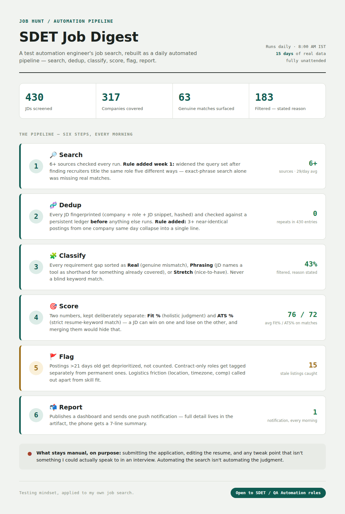
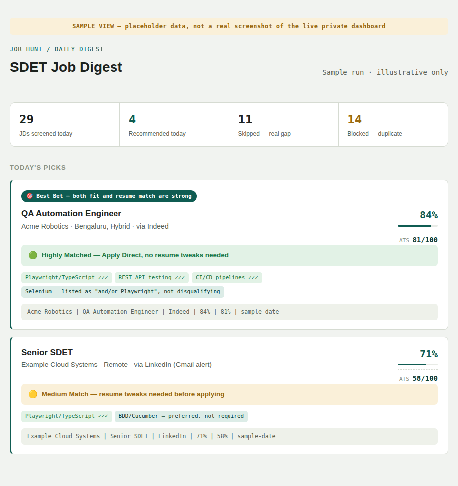

# SDET Job Digest — an AI-agent-orchestrated job search pipeline

I'm an SDET (3.6+ years, Playwright/TypeScript, AI-assisted QA). My job search kept costing me the same manual review every morning — open a job board, skim a JD, guess at fit, half-remember if I'd seen it before. That's exactly the kind of repetitive, rule-based process I spend my day job eliminating, so I pointed the same instinct at my own search.

This repo documents the system: what it does, the rules behind each step, and the real numbers from running it for 15 days straight.

## What this is — and isn't

**This is an AI-agent-orchestrated pipeline, not a hand-coded framework.** I designed every rule below — what counts as a duplicate, what counts as a real skill gap versus just phrasing, how to weigh fit against ATS match, when a posting is stale. An AI agent (running on a daily schedule) implements those rules, executes the pipeline, and maintains a persistent data store between runs. I review the rules and the output; I did not hand-write the orchestration code line by line.

I think that distinction is worth stating plainly rather than implying otherwise. Directing an agent to build and iteratively refine a working data pipeline is, to me, a more current and more relevant skill for the AI-assisted QA roles I'm targeting than solo-scripting the same thing would be — but only if I'm honest about which one it is.

**What it does automatically:** searches multiple job boards, deduplicates every posting against a persistent ledger, classifies requirement gaps, scores fit and ATS match, flags stale/contract/logistics issues, and reports a daily summary.

**What stays entirely manual, by design:** submitting any application, editing my resume, and suggesting any skill I can't genuinely back up in an interview. Automating the search isn't automating the judgment.

## The numbers (15 days, real data)

| Metric | Value |
|---|---|
| Postings screened | 430 |
| Unique companies | 317 |
| Sources checked automatically | 6+ |
| Genuine matches surfaced | 63 (40 top picks + 23 backups) |
| Filtered out with a stated reason | 183 (43%) |
| Average fit / ATS score on surfaced matches | 76% / 72% |
| Stale postings caught (oldest: 6 months) | 15 |
| Estimated manual screening time reclaimed | ~25–30 hours |

*Sample dashboard view below uses anonymized placeholder data — the live system runs against my real, private job search and isn't published.*

## The pipeline — six steps, every morning at 8AM

| Step | What it does | Docs |
|---|---|---|
| 1. Search | Pulls fresh postings from 6+ sources | [docs/01-search.md](docs/01-search.md) |
| 2. Dedup | Fingerprints and checks every posting against a persistent ledger | [docs/02-dedup.md](docs/02-dedup.md) |
| 3. Classify | Sorts every requirement gap as real / phrasing / stretch | [docs/03-classify.md](docs/03-classify.md) |
| 4. Score | Two independent numbers — Fit % and ATS % — never merged | [docs/04-score.md](docs/04-score.md) |
| 5. Flag | Catches staleness, contract-only roles, and logistics friction | [docs/05-flag.md](docs/05-flag.md) |
| 6. Report | Publishes a dashboard and sends one push notification | [docs/06-report.md](docs/06-report.md) |

See [docs/rules-changelog.md](docs/rules-changelog.md) for how these rules actually evolved — most of them exist because something specific broke or slipped through in production, not because I anticipated it up front.

## Code in this repo

- [`snippets/fingerprint.py`](snippets/fingerprint.py) — the real deduplication fingerprint function.
- [`snippets/ledger_schema.json`](snippets/ledger_schema.json) — the real shape of a ledger document (values are placeholders).

## Status

This is a living personal tool, actively running daily. This repo is a point-in-time writeup of the rules and design as of September 2026 — I'll update `rules-changelog.md` as the system changes, rather than guaranteeing every future rule gets documented the same day it ships.

## About me

SDET / QA Automation Engineer, Playwright + TypeScript, actively building in AI-assisted QA (MCP, AI testing agents, LLM evaluation). Open to SDET / QA Automation Engineer roles — Bengaluru, Hyderabad, or remote.
